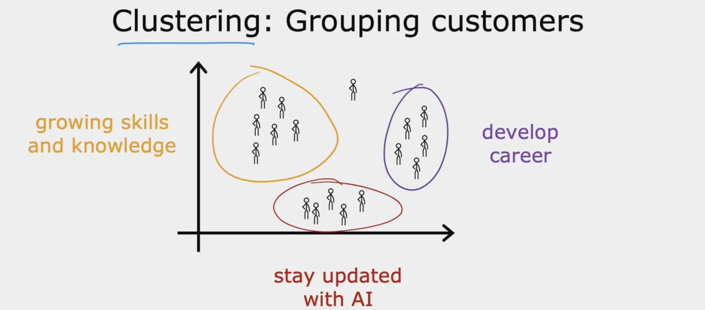
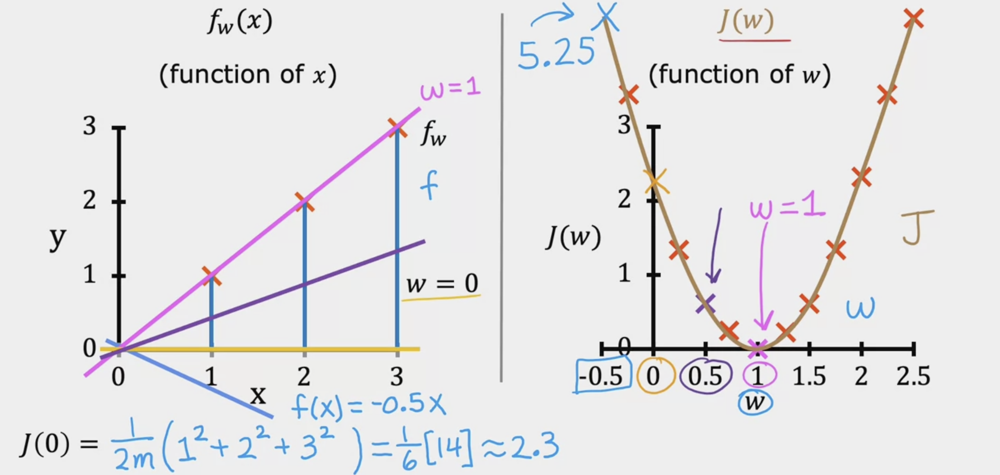
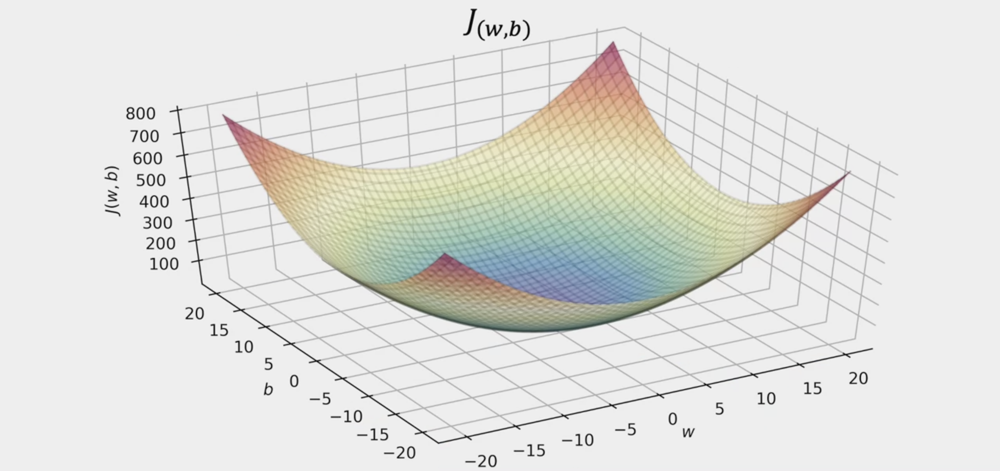
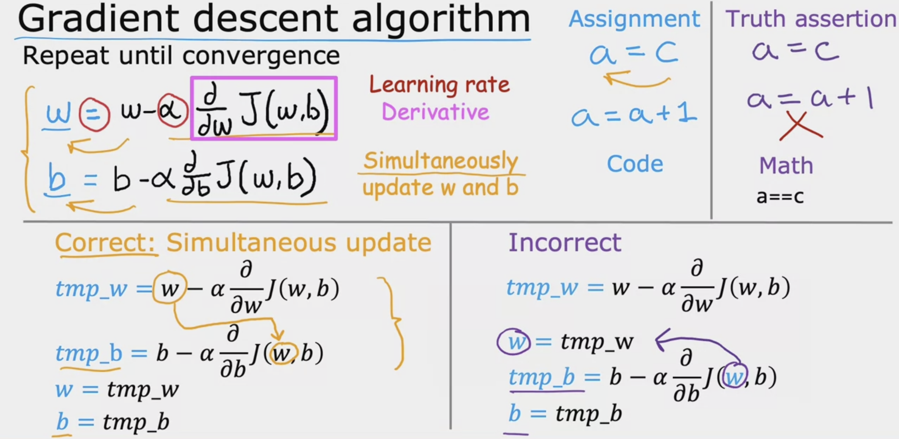

# Machine Learing
## Machine Learning Algorithems
- Supervised learning
  - Used most in real-world applications.
  - rapid advancements
- Unsupervised learning
- Recommender systems
- Reinforcement learning

## Supervised Learning
- 
- 
- 
  - Example of supervised learning
### Regression
- Predict a number
- infinitely many possible output

### Classification
- 
- 
- ('class' and 'category' here meaning the same thing)
- Classification alorithems predict categories
- 

- Learns from being given "right answers"
- 

## Unsupervised Learning
- Data only comes with inputs x, but not output labels y.
- Algorithm has to find structure in the data.
- 
- main types:
  - Clustring
    - Group similar data points together.
  - Anomaly detection
    - Find unusual data points.
  - Dimensionality reduction
    - Compress data using fewer numbers.

### Clustring alorithems 
- 

## Liner regression model
### 
- 
- 

### Terminology
- 

### What happen?
- 
  
## Cost function formula

### What do w,b do?
- 
- 
- 

### What is cost function
- 
- 
- 
- 
- How to choose w?
- choose w to minimize J(w)
- 
  
## Visualizing the cost function
- 
- 
- 
- 
- 
- 
- 
- 
- The last ine best fit

## Gradient Descent 梯度下降

## Gradient descent algorithm

